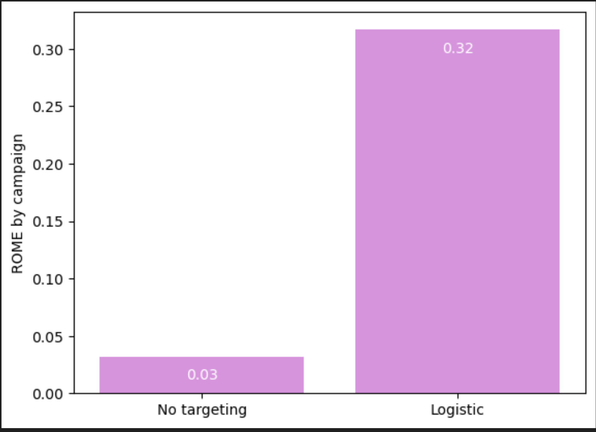
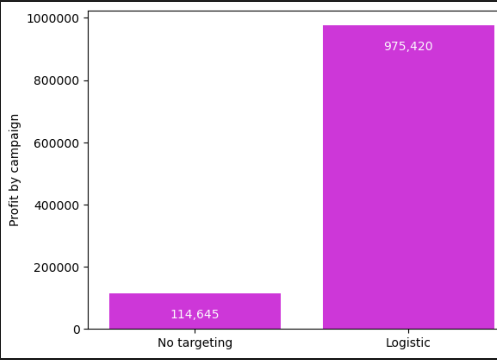

# Targeting Mobile App Messages

Tuango is a "deal-of-the-day" website in China that offers discounted gift certificates for use at local or national retailers. This project aimed to optimize targeting strategies for mobile app marketing campaigns, focusing on reducing customer attrition due to excessive or irrelevant messages.

## Chief Data Scientist's Approach
The Chief Data Scientist for the Mobile Marketing group, decided to re-evaluate how Tuango executed mobile campaigns. She recognized that sending too many messages could lead customers to block future promotions, impacting customer lifetime value.

## Project Objectives
- Develop targeted marketing campaigns to increase profitability and minimize customer attrition.

## Key Steps
1. **Sample Creation**: A 5% random sample was selected from 418,160 mobile customers in Hangzhou, resulting in 20,908 users.
2. **Deal Offer**: The sample was offered a karaoke session deal priced at 49 RMB, with Tuango taking a 50% fee.
3. **Customer Response Tracking**: Responses to the deal offer were tracked, including whether customers purchased and how many sessions they bought.
4. **Logistic Regression Analysis**: A model was built to predict customer responses using factors like recency, frequency, monetary (RFM), age, gender, and music category.
5. **Assessing Variable Importance**: Permutation Importance was used to identify which explanatory variables had the most significant impact on customer purchase behavior.
6. **Linear Regression for Order Size**: A model was built to predict order size, focusing on customers who purchased the karaoke deal.
7. **Profitability Analysis**: The breakeven response rate was calculated, and the projected profit was estimated for targeting all 397,252 remaining customers. This was compared with targeting only those with a predicted probability of purchase exceeding the breakeven rate.
8. **Bar Charts and Performance Analysis**: Bar charts were created to visualize profit and return on marketing expenditure for different targeting approaches.

# Tuango: Targeting Mobile App Messages

## Findings and Outcomes

Through meticulous analysis and targeted marketing strategies, we identified key outcomes:

- The true marginal cost of sending an additional deal message was determined to be 9 RMB.
- A break-even response rate was calculated, emphasizing its significance for efficient targeting.
- We proposed a more targeted approach, which aimed to reduce the risk of customer drop-off and maximize profitability.

The implementation of a targeted approach using logistic regression resulted in a substantial increase in the Return on Marketing Expenditure (ROME) and overall profit, as depicted in the charts below.

### ROME by Campaign

*Comparison of ROME between no targeting and logistic targeting approach.*

### Profit by Campaign

*Comparison of profits between no targeting and logistic targeting approach.*

The targeted logistic approach outperformed the no targeting strategy, leading to a 10-fold increase in ROME and an 8.5-fold increase in profit. These visuals clearly illustrate the advantage of implementing a data-driven targeting strategy in marketing campaigns.

